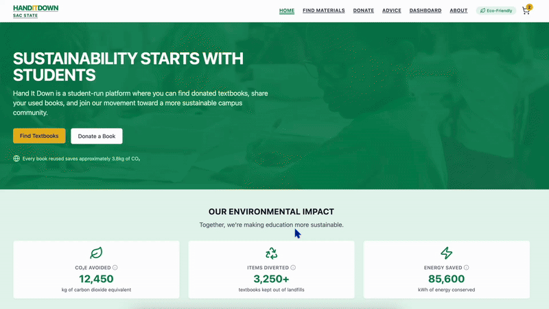
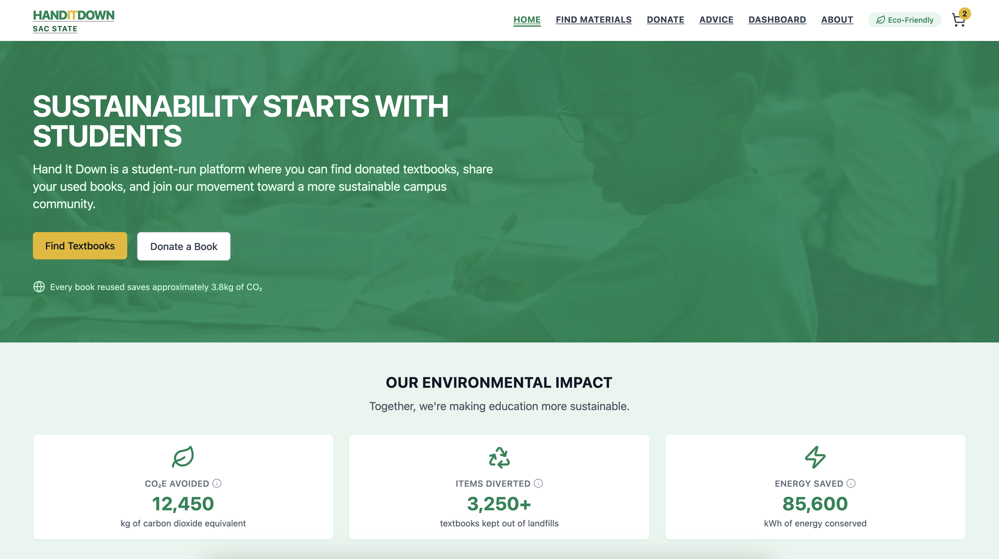
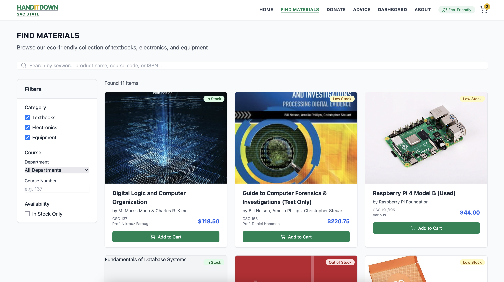
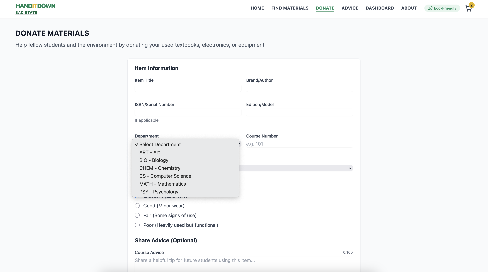
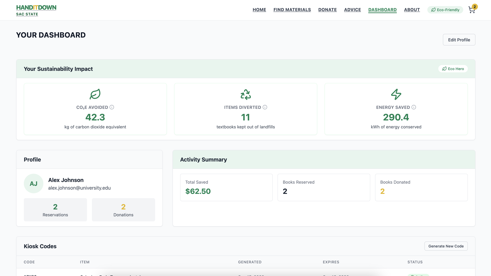

# Hand It Down

**Affordable, sustainable textbook and school-material exchange for college students.**

[](#-recognition)
[](#-recognition)

> **Live app:** [handitdown.netlify.app](https://handitdown.netlify.app/)  
> **Repository:** [github.com/g35k/HandItDown](https://github.com/g35k/HandItDown)

## Demo

<p align="center">
  
</p>

---

## Overview

**Hand It Down** helps college students exchange textbooks, electronics, and course equipment—cutting costs and waste versus buying new.

Born as a **Hornet Hacks 3.0** frontend MVP, the product now runs as a **deployed post-hackathon prototype** on the path to production: full browse-to-checkout flows, donation and advice surfaces, and a sustainability dashboard. Selected for the **Innovation Lab** at Sacramento State University ([CSU Sacramento](https://www.csus.edu/)), within the **[Carlsen Center for Entrepreneurship and Innovation](https://www.csus.edu/center/carlsen/meet-us/)**.

| Status | Description |
|--------|-------------|
| **Implemented** | React + TypeScript SPA — routing, forms, search/filtering, validated checkout UI |
| **Planned** | Supabase auth, PostgreSQL persistence, payments, kiosk validation |

Catalog, cart, and profile data are **sample-driven today**; backend integration is scoped but not wired (`@supabase/supabase-js` is installed for the next phase only).

---

## Problem & Motivation

Students face high material costs and heavy environmental waste from single-use textbooks and gear. Hand It Down improves **accessibility** by routing surplus campus inventory to students who need it—reuse over repurchase, with lower financial and ecological cost.

---

## Features

### Implemented (frontend MVP)

- **Responsive UI** — Tailwind layout, shared nav, mobile-friendly pages
- **Routing** — React Router across find, donate, advice, dashboard, cart, billing, about
- **Find & filter** — Search by keyword, ISBN, course, professor; filter by category, department, stock
- **Item details** — Pricing breakdowns and peer advice on material pages
- **Cart & checkout** — Cart, coupons, billing validation, simulated order confirmation
- **Donate** — Donation form with client-generated kiosk codes and expiry timer
- **Student advice** — Submit and search course-specific tips
- **Dashboard** — Reservations, donations, advice history, sustainability metrics (UI only)
- **About** — Mission, how-it-works, sustainability context

### Planned

- **Auth** — Student accounts via Supabase
- **Data layer** — PostgreSQL listings, reservations, donations, profiles
- **Payments & inventory** — Server-side checkout, stock sync, admin tooling
- **Kiosk validation** — Server-verified drop-off codes

---

## Tech Stack

| Layer | Technology |
|-------|------------|
| **Framework** | [React 18](https://react.dev/) |
| **Language** | [TypeScript](https://www.typescriptlang.org/) |
| **Build tool** | [Vite 7](https://vite.dev/) |
| **Routing** | [React Router 7](https://reactrouter.com/) |
| **Styling** | [Tailwind CSS 3](https://tailwindcss.com/) |
| **Icons** | [Lucide React](https://lucide.dev/) |
| **Linting** | ESLint 9 + TypeScript ESLint |
| **Planned backend** | [Supabase](https://supabase.com/) (Auth, PostgreSQL, Storage) |

---

## Architecture

### Current (frontend-only)

```text
┌─────────────────────────────────────────────────────────┐
│                    Browser (SPA)                        │
│  React + TypeScript + Vite + React Router + Tailwind    │
├─────────────────────────────────────────────────────────┤
│  Pages: Home · Find · Donate · Advice · Dashboard ·     │
│         Textbook Details · Cart · Billing · About       │
├─────────────────────────────────────────────────────────┤
│  State: React useState / useMemo (local component state)│
│  Data:  In-memory sample arrays (no network persistence)│
└─────────────────────────────────────────────────────────┘
```

**Key routes**

| Path | Purpose |
|------|---------|
| `/` | Landing & sustainability highlights |
| `/find` | Browse, search, filter |
| `/textbooks/:id` | Material detail |
| `/donate` | Donation & kiosk code |
| `/advice` | Peer advice |
| `/dashboard` | Activity & impact (UI) |
| `/cart` | Shopping cart |
| `/billing` | Checkout |
| `/about` | Mission & how it works |

### Planned (target architecture)

```text
┌──────────────┐     HTTPS/API      ┌────────────────────────────┐
│  React SPA   │ ◄──────────────► │  Supabase                  │
│  (Vite)      │                  │  · Auth (student accounts) │
└──────────────┘                  │  · PostgreSQL (listings,   │
                                  │    reservations, donations)│
                                  │  · Storage (images/docs)   │
                                  └────────────────────────────┘
```

Client-side search and validation will move server-side as listings, payments, and inventory become authoritative.

---

## Challenges & Lessons Learned

- **Scope vs. vision** — Shipped an end-to-end UX first; deferred persistence to validate flows and accessibility goals quickly.
- **Sustainability narrative** — Impact metrics (CO₂e avoided, items diverted) grounded the product in measurable outcomes—**1st Place, Sustainability** at Hornet Hacks 3.0.
- **SPA limits** — Filters and validation work locally today; payments, inventory, and auth belong on the server for consistency and security.
- **Clean boundaries** — Sample data isolated per module so the Supabase migration path stays explicit and demos stay honest.

---

## Roadmap

- [ ] Supabase project + env configuration
- [ ] Student auth (email / OAuth)
- [ ] PostgreSQL-backed listings CRUD
- [ ] API persistence for cart, reservations, donations
- [ ] Payment provider integration (e.g., Stripe via Edge Functions)
- [ ] Server-side kiosk code validation
- [ ] Admin inventory & intake dashboard
- [x] Production frontend on [Netlify](https://handitdown.netlify.app/)
- [ ] CI/CD on merge
- [ ] Innovation Lab pilot expansion (departments / campuses)

---

## Getting Started

**Prerequisites:** Node.js 18+

```bash
git clone https://github.com/g35k/HandItDown.git
cd HandItDown
npm install
npm run dev      # http://localhost:5173
```

```bash
npm run build    # production build
npm run preview  # preview build
npm run lint     # ESLint
```

**Future env** (not required for the current MVP):

```env
VITE_SUPABASE_URL=your_project_url
VITE_SUPABASE_ANON_KEY=your_anon_key
```

---

## Screenshots

| Home | Find Materials |
|:----:|:--------------:|
|  |  |

| Donate | Dashboard |
|:------:|:---------:|
|  |  |

---

## Recognition

- **Hornet Hacks 3.0** — **1st Place, Sustainability Track** (Sacramento State University)
- **[Carlsen Center for Entrepreneurship and Innovation](https://www.csus.edu/center/carlsen/meet-us/) — [Innovation Lab](https://www.csus.edu/center/carlsen/build-with-carlsen-center/innovation-lab.html)** — Continued campus entrepreneurship development

---

## Team

| Name | Role |
|------|------|
| **Kayla Garibay** | Project Lead · Full-Stack Development · Product Coordination |
| **Indira Debbad** | Backend Development · Research |
| **Ankita Patwal** | Backend Development · Business Analysis · Validation |
| **Mina Hi** | Frontend Development · Research |
| **Althaea Locano** | Frontend Development · Research |

---

## License

[MIT License](./LICENSE)

---

<p align="center">
  Affordable materials for students. Less waste for campuses.
</p>
